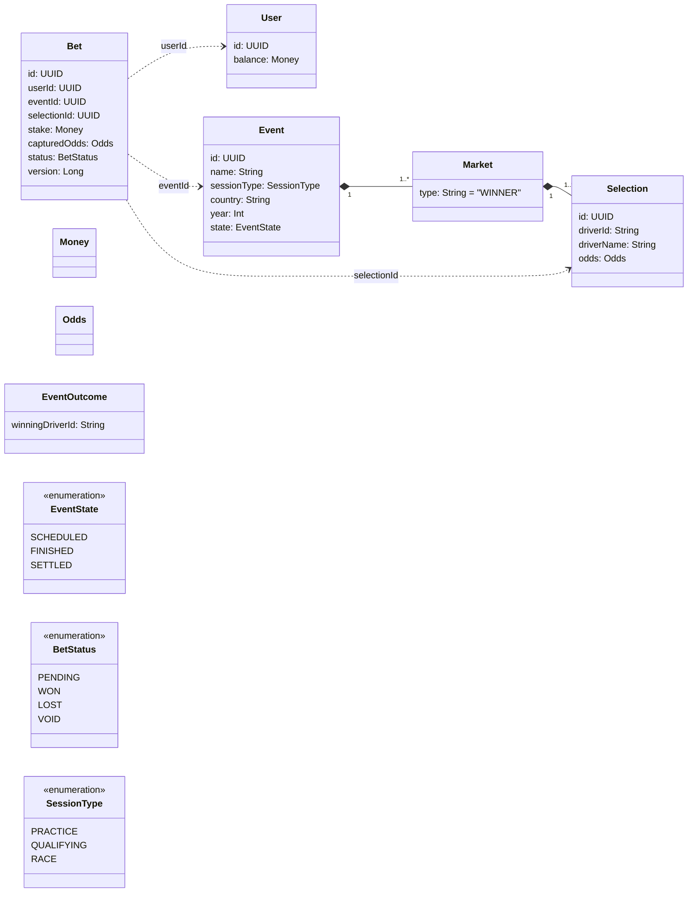

# Sporty F1 - Formula 1 Betting API

## Problem & Scope

A **Formula 1 betting platform** that allows users to place bets on F1 race outcomes (drivers to win). The system provides:

- **F1 Event Management**: Lists upcoming F1 sessions (Practice, Qualifying, Race) with real-time driver markets
- **Betting System**: Users can place bets on drivers with automatic odds capture and idempotency support
- **Balance Management**: Users start with €100, balance updates through betting outcomes
- **Race Settlement**: Record race winners and automatically settle bets with payouts

**Core Use Cases:**
- Browse F1 events with filtering (sessionType, country, year)
- Place bets on race drivers with captured odds
- Track user balance and betting history
- Record race outcomes and settle winning bets

**Constraints:**
- Users cannot deposit/withdraw money (€100 starting balance only)
- Users are pre-registered (no sign-up flow)
- F1 data comes from pluggable providers (currently stub data)

## Non-goals

- **External Database**: Uses in-memory repositories (no JPA, ORM, or database drivers)
- **User Registration**: Users are pre-registered and referenced by UUID
- **Payment Processing**: No deposit/withdrawal - users have fixed €100 starting balance
- **Real-time Updates**: No WebSocket or server-sent events (REST API only)
- **Lombok**: Clean Java code without annotation processors
- **Advanced Features**: No messaging, scheduling, or complex cloud integrations

## Architecture (Hexagonal)

This application implements **Hexagonal Architecture (Ports & Adapters)** to ensure clean separation of concerns:

- **Domain Layer** (`domain/`): Pure business logic with no framework dependencies
  - **Entities**: `User`, `Event`, `Bet`, `Market`, `Selection` 
  - **Value Objects**: `Money`, `Odds`
  - **Domain Services**: `OddsPolicy`
  - **Enums**: `BetStatus`, `EventState`, `SessionType`

- **Application Layer** (`application/`): Use case orchestration services
  - `ListEventsService`, `PlaceBetService`, `UserBalanceService`, `RecordOutcomeService`

- **Infrastructure Layer** (`infrastructure/`):
  - **Inbound Adapters**: REST controllers (`EventController`, `BetController`, `UserController`)
  - **Outbound Adapters**: In-memory repositories, F1 provider adapters (stub/HTTP)
  - **Configuration**: Spring Boot wiring (`ApplicationConfig`)

- **Ports** (`ports/`): Interface contracts
  - **Inbound**: Defined implicitly by application services  
  - **Outbound**: `F1ProviderPort`, `UserRepository`, `BetRepository`, `EventRepository`

## Domain Model



## Quick Start

**Prerequisites:** JDK 21+ 

```bash
# 1. Build and test the application
./gradlew build

# 2. Run the application (starts on http://localhost:8080)
./gradlew bootRun

# 3. Test all functionality
./run_functional_tests.sh
```

**Development Commands:**
- **Format code**: `./gradlew spotlessApply`
- **Run tests**: `./gradlew test` 
- **Check code style**: `./gradlew spotlessCheck`

## API Endpoints

| Method | Endpoint | Description |
|--------|----------|-------------|
| GET | `/actuator/healthz` | Health check - returns `OK` |
| GET | `/api/v1/events` | List F1 events with filtering support |
| GET | `/api/v1/users/{userId}/balance` | Get user balance (auto-creates user) |
| POST | `/api/v1/bets` | Place bet with idempotency support |
| POST | `/api/v1/events/{eventId}/outcome` | Record race outcome |

### API Examples

```bash
# Health check
curl http://localhost:8080/actuator/healthz

# List all events
curl "http://localhost:8080/api/v1/events" | jq .

# Filter events (race sessions in Australia, 2025)
curl "http://localhost:8080/api/v1/events?sessionType=RACE&country=Australia&year=2025" | jq .

# Check user balance (creates user with €100 if new)
curl "http://localhost:8080/api/v1/users/123e4567-e89b-12d3-a456-426614174000/balance" | jq .

# Place a €25 bet (use real eventId/selectionId from events endpoint)
curl -X POST "http://localhost:8080/api/v1/bets" \
  -H "Content-Type: application/json" \
  -H "Idempotency-Key: my-bet-001" \
  -d '{
    "userId": "123e4567-e89b-12d3-a456-426614174000",
    "eventId": "550e8400-e29b-41d4-a716-446655440001",
    "selectionId": "SELECTION_ID_FROM_EVENT",
    "stakeAmount": 25.00,
    "currency": "EUR"
  }' | jq .

# Record race outcome (Lewis Hamilton wins)
curl -X POST "http://localhost:8080/api/v1/events/EVENT_ID/outcome" \
  -H "Content-Type: application/json" \
  -d '{"winningDriverId": "d1"}' 
```

## Testing Strategy

- **Unit tests**: Domain and application services with JUnit 5, AssertJ, Mockito.
- **Web layer tests**: Controller slice tests (no full context) when endpoints exist.
- **Determinism**: Avoid time/randomness in tests; inject clocks and id generators.

Commands:

- `./gradlew test`

## Design Decisions

- **Gradle Kotlin DSL** with Spring Boot 3.3.4 and comprehensive dependency management
- **Java 21 toolchain** with modern language features and performance improvements  
- **No Lombok/JPA/DB drivers** - keeps domain clean, reduces complexity, and enables fast startup
- **Spotless** with Google Java Format for consistent code style across the project
- **Hexagonal Architecture** - domain logic independent from frameworks, supports testability and maintainability
- **In-Memory Storage** - simplifies development and demo deployment without external dependencies
- **UUID-based Entities** - provides globally unique identifiers suitable for distributed systems
- **Event-Driven Design** - clean separation between F1 events, betting, and outcome processing

## Idempotency & Determinism

- **Idempotent Betting**: Uses `Idempotency-Key` header to prevent duplicate bet placement - essential for financial operations
- **Pure Domain Services**: All side effects isolated in infrastructure adapters; domain functions remain deterministic and testable  
- **Controlled Dependencies**: Inject `Clock` and `IdGenerator` to control time/randomness in tests and ensure reproducible behavior
- **Consistent Event Data**: F1 events are loaded once and persisted in memory for stable filtering and querying
- **Deterministic Odds**: While demo uses random odds, the architecture supports plugging in real odds providers

## Running the Application

### Quick Start

1. **Build the application**:
   ```bash
   ./gradlew build
   ```

2. **Run the application**:
   ```bash
   ./gradlew bootRun
   ```

3. **Application will start on**: `http://localhost:8080`

### Available Endpoints

| Method | Endpoint | Description |
|--------|----------|-------------|
| GET | `/actuator/healthz` | Health check |
| GET | `/api/v1/events` | List F1 events (supports filters: sessionType, year, country, page, size) |
| POST | `/api/v1/bets` | Place bet (supports Idempotency-Key header) |
| GET | `/api/v1/users/{userId}/balance` | Get user balance |
| POST | `/api/v1/events/{eventId}/outcome` | Record race outcome |

### Testing Strategy

#### **Unit & Integration Tests**
Comprehensive test suite covering all layers:
```bash
./gradlew test  # Runs all tests (19 total)
```

**Test Coverage:**
- ✅ **Domain Layer**: `Money`, `Odds`, `OddsPolicy` with edge cases
- ✅ **Application Services**: Betting flow, event listing, balance management
- ✅ **Integration Tests**: Full betting workflow with WebTestClient
- ✅ **Repository Tests**: In-memory implementations with concurrent access
- ✅ **Web Layer**: REST controllers with proper error handling

#### **Functional Testing**
End-to-end validation with real HTTP calls:

```bash
# Automated functional test suite
./run_functional_tests.sh
```

**Test Scenarios:**
- 🏎️ **F1 Event Management**: List, filter by session type/country/year
- 💰 **User Balance**: Auto-creation, balance tracking, bet deductions
- 🎯 **Betting Flow**: Place bets, idempotency, odds capture, validation
- 🏁 **Race Outcomes**: Winner declaration, bet settlement, payout calculation
- 🛡️ **Error Handling**: Invalid requests, insufficient funds, missing data

**Manual Testing Guide:**
For detailed cURL examples and step-by-step workflow testing:
```bash
cat FUNCTIONAL_TESTS.md  # Comprehensive testing documentation
```

#### **Example Test Workflow**
```bash
# Start application
./gradlew bootRun &

# 1. Health check
curl http://localhost:8080/actuator/healthz

# 2. List Australian Grand Prix races 
curl "http://localhost:8080/api/v1/events?sessionType=RACE&country=Australia" | jq .

# 3. Create user and check balance
curl "http://localhost:8080/api/v1/users/test-user-123/balance" | jq .

# 4. Place €25 bet on Hamilton (use real IDs from step 2)
curl -X POST "http://localhost:8080/api/v1/bets" \
  -H "Content-Type: application/json" \
  -H "Idempotency-Key: test-bet-001" \
  -d '{
    "userId": "test-user-123",
    "eventId": "[EVENT_ID_FROM_STEP_2]", 
    "selectionId": "[SELECTION_ID_FROM_STEP_2]",
    "stakeAmount": 25.00,
    "currency": "EUR"
  }' | jq .

# 5. Record Hamilton wins, check updated balance
curl -X POST "http://localhost:8080/api/v1/events/[EVENT_ID]/outcome" \
  -H "Content-Type: application/json" \
  -d '{"winningDriverId": "d1"}' && \
curl "http://localhost:8080/api/v1/users/test-user-123/balance" | jq .
```

## Development Notes

### How AI was used (audit notes)

- **Project Scaffolding**: Generated initial Gradle Kotlin DSL, Spring Boot configuration, and Spotless setup
- **Architecture Implementation**: Assisted with hexagonal architecture pattern implementation and dependency injection
- **Test Development**: Helped create comprehensive test suite covering domain, application, and integration layers
- **Bug Resolution**: Identified and fixed UUID parsing issues, event persistence problems, and filtering logic
- **Documentation**: Generated comprehensive README, functional testing guides, and API documentation
- **Code Quality**: Applied consistent formatting, naming conventions, and architectural patterns

### Repository Information

This F1 betting API demonstrates modern Spring Boot development with clean architecture principles. The codebase is ready for:
- **GitHub Publication**: Comprehensive documentation and testing ready for open source
- **Professional Development**: Production-ready patterns and practices  
- **Educational Use**: Clear examples of hexagonal architecture, testing strategies, and API design
- **Extension**: Pluggable architecture supports real F1 data providers and persistent storage

**Key Highlights:**
- 19 passing tests with comprehensive coverage
- Complete betting workflow with financial operations
- Event filtering and user management
- Idempotency and error handling
- Clean architecture with testable design
- Produced this README scaffold and hexagonal structure guidance.
- No proprietary code was ingested; developer reviewed and executed all changes.


