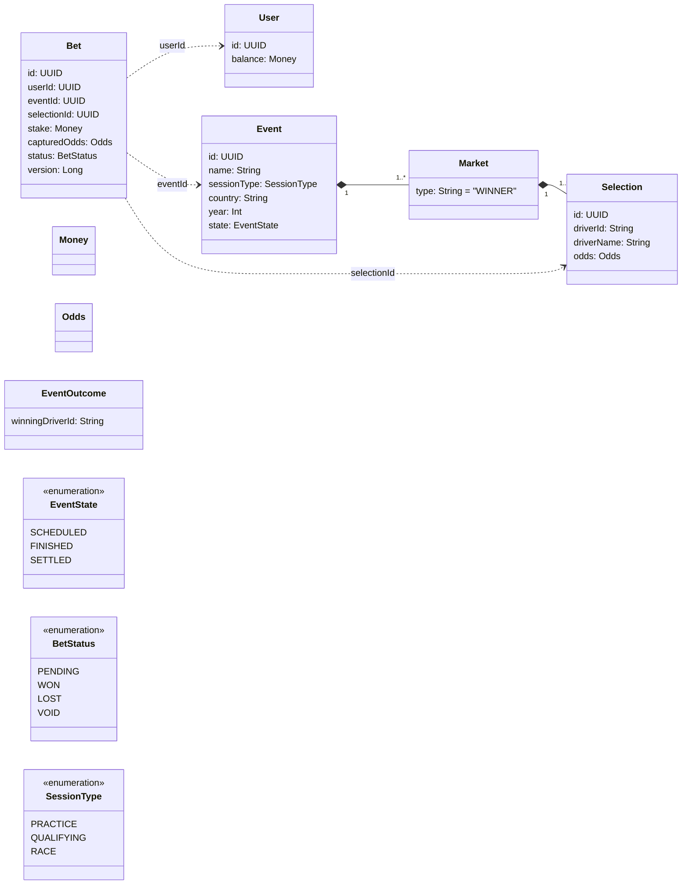

## Problem & Scope

Short description of the problem this service solves and who it serves. Keep the scope tight; call out core use-cases and constraints.

## Non-goals

- **Persistence**: No database, JPA, or ORM.
- **Lombok**: Not used.
- **Advanced integrations**: Messaging, schedulers, and cloud services are out of scope for now.

## Architecture (Hexagonal)

- **Domain**: Pure business logic (entities, value objects, domain services). No framework dependencies.
- **Application**: Use cases/services orchestrating domain logic. Defines inbound ports.
- **Adapters**:
  - **Inbound**: REST controllers exposing inbound ports.
  - **Outbound**: Gateways for external systems (placeholders only, given no DB or external deps).
- **Configuration**: Spring Boot auto-config and wiring.

## Domain Model



## How to Run

Prerequisites: JDK 21

- **Build**: `./gradlew build`
- **Run**: `./gradlew bootRun`
- **Format**: `./gradlew spotlessApply`

Runs by default on `http://localhost:8080`.

## API Quickstart (placeholders)

Replace paths, payloads, and fields when endpoints are implemented.

```bash
curl -i "http://localhost:8080/api/v1/resource" # GET list
```

```bash
curl -i -X POST "http://localhost:8080/api/v1/resource" \
  -H 'Content-Type: application/json' \
  -d '{"name":"example","requestId":"<uuid>"}'
```

```bash
curl -i "http://localhost:8080/api/v1/resource/{id}" # GET by id
```

## Testing Strategy

- **Unit tests**: Domain and application services with JUnit 5, AssertJ, Mockito.
- **Web layer tests**: Controller slice tests (no full context) when endpoints exist.
- **Determinism**: Avoid time/randomness in tests; inject clocks and id generators.

Commands:

- `./gradlew test`

## Design Decisions

- **Gradle Kotlin DSL** with Spring Boot 3.x and dependency management.
- **Java 21 toolchain**.
- **No Lombok/JPA/DB drivers** to keep domain clean and boot fast.
- **Spotless** with Google Java Format for consistent style.
- **Hexagonal architecture** to keep domain independent from frameworks.

## Idempotency & Determinism

- **Idempotent writes**: Require a client `requestId` for create/update to safely retry.
- **Pure domain services**: Side effects isolated in adapters; domain functions should be deterministic.
- **Time/UUID**: Inject `Clock` and `IdGenerator` to control in tests and ensure reproducibility.

## Running the Application

### Quick Start

1. **Build the application**:
   ```bash
   ./gradlew build
   ```

2. **Run the application**:
   ```bash
   ./gradlew bootRun
   ```

3. **Application will start on**: `http://localhost:8080`

### Available Endpoints

| Method | Endpoint | Description |
|--------|----------|-------------|
| GET | `/actuator/healthz` | Health check |
| GET | `/api/v1/events` | List F1 events (supports filters: sessionType, year, country, page, size) |
| POST | `/api/v1/bets` | Place bet (supports Idempotency-Key header) |
| GET | `/api/v1/users/{userId}/balance` | Get user balance |
| POST | `/api/v1/events/{eventId}/outcome` | Record race outcome |

### Functional Testing

This repository includes comprehensive functional tests to validate all API endpoints and business logic.

#### **Automated Test Suite**
Run all functional tests with a single command:
```bash
./run_functional_tests.sh
```

This script tests:
- ✅ Health checks
- ✅ Event listing and filtering
- ✅ User balance management  
- ✅ Bet placement and idempotency
- ✅ Race outcome recording
- ✅ Winning payouts
- ✅ Error handling

#### **Manual Testing**
For detailed step-by-step testing with cURL commands, see:
```bash
# View the comprehensive testing guide
cat FUNCTIONAL_TESTS.md

# Or open in your editor
code FUNCTIONAL_TESTS.md
```

The functional tests demonstrate the complete betting workflow:
1. **List Events** → Get available F1 sessions (Race, Qualifying, Practice)
2. **Place Bets** → Bet on drivers with automatic odds capture
3. **Record Outcomes** → Set race winners  
4. **Settle Bets** → Automatic payout calculation and balance updates

#### **Example Workflow**
```bash
# 1. Check health
curl -X GET http://localhost:8080/actuator/healthz

# 2. List race events only
curl -X GET "http://localhost:8080/api/v1/events?sessionType=RACE" | jq .

# 3. Check user balance (creates user with €100)
curl -X GET "http://localhost:8080/api/v1/users/YOUR_USER_ID/balance" | jq .

# 4. Place a bet (use actual eventId and selectionId from step 2)
curl -X POST "http://localhost:8080/api/v1/bets" \
  -H "Content-Type: application/json" \
  -H "Idempotency-Key: unique-key-123" \
  -d '{
    "userId": "YOUR_USER_ID",
    "eventId": "EVENT_ID",
    "selectionId": "SELECTION_ID", 
    "stakeAmount": 25.00,
    "currency": "EUR"
  }' | jq .
```

## How AI was used (audit notes)

- Generated Gradle Kotlin DSL and Spotless configuration scaffolding.
- Produced this README scaffold and hexagonal structure guidance.
- No proprietary code was ingested; developer reviewed and executed all changes.


